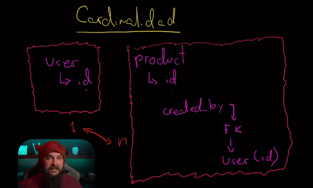
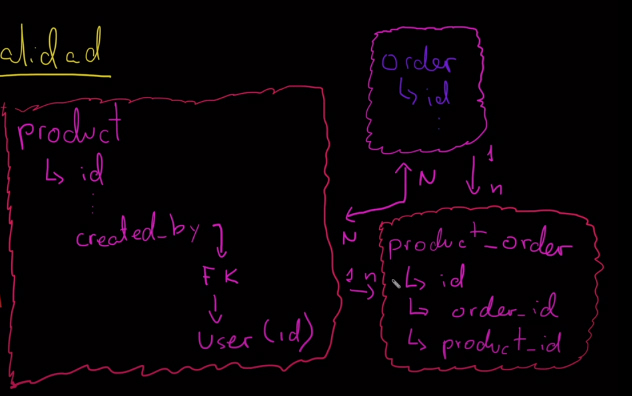
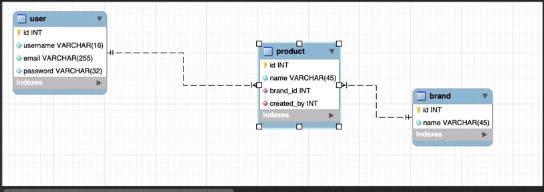
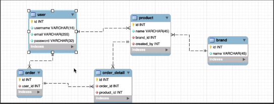

# Cardinalidad

Se refiere a las relaciones, referencias, entre las tablas.

## Cardinalidad 1 <=> n

En el ejemplo de las tablas user y product, un usuario puede tener `n` cantidad de productos, pero los productos sólo pueden tener 1 producto. Esto sería una cardinalidad de 1 es a n (1 <=> n)

## Cardinalidad n <=> n

- Puede haber múltiples registros entre una y otra.

- Ejemplo una orden de compra puede tener múltiples productos y viceversa.

- La cardenalidad n <=> n, requiere una tabla intermedia para hacer las consultas. con los id's de ambas tablas.
  - Esta tabla intermedia tendrá una relación 1<=>n con las tablas de origen.

## Diagramas entidad relación

### Agregar diagrama

- Workbench
- Icono home
- Icono models (imagen varias tablas enlzadas)
- -
- Add diagram

### Opciones diagrama BBDD

- Crear nueva tabla de cero
  - Botón place a new table => T
- Panel derecho plantillas
  - Doble click en plantilla a utilizar
- Es posible eliminar y agregar columnas de la tabla
- Se puede modificar información de las columnas como el tipo de dato
- Casillas para marcar opciones como PK, NN (not null), UQ (Unique)

### Obtener código del modelo de tabla creado o editado

Click derecho => copy to clipboard

### Establecer FK en el modelo

- Pestaña inferior Foreign keys
  - Foreign Key
  - Referenced table
- Cuadro Foreign key details
  - Marcar columna referenciada
  - Importante no olvidar marcar la opción not null en la columna.

## Unique (UC)

Indica que el registro debe tener un valor que no se repita con respecto a los otros de su tipo.

## if exists / if not exists

Condicociona la consulta a que la BBDD, tabla, columna exista o no.

## Index

Carga los campos especificados en memoria para hacer búsquedas más rápidas

### Evitar duplicidad de datos

Para no cargar tantos datos en memoria crear tablas de las opciones de valores que tienen los registros de las diferentes columnas ejemplo => T product => tabla => brand

### Crear tablas intermedias

- Opción n:m (n <=> m)
- Pinchar las tablas origen de la tabla intermedia
- La tabla intermedia se crea automáticamente

### Exportar modelo de la BBDD a consulta

- File
- Export
- Fordward Engineer SQL CREATE Script
  - name script
  - folder
  - Guardar
  - Copiar y pegar código

## Ejercicio a realizar

